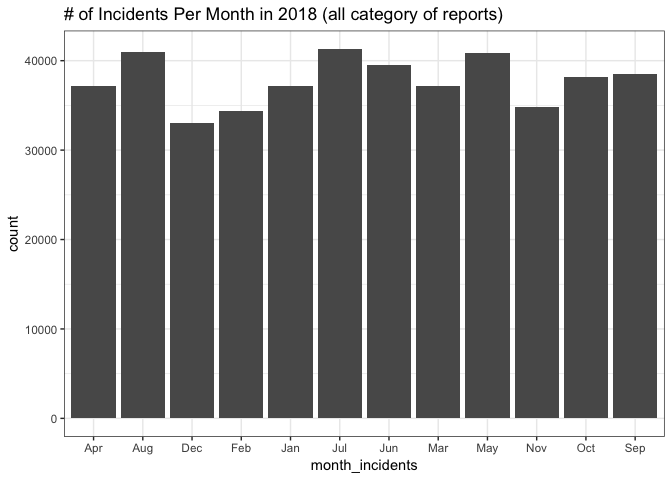
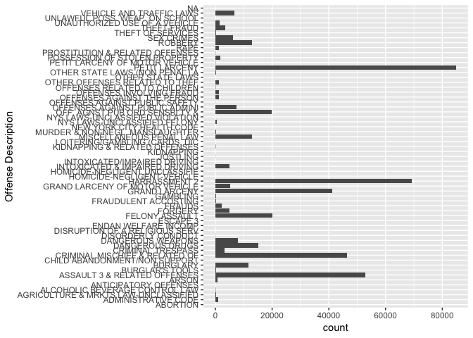
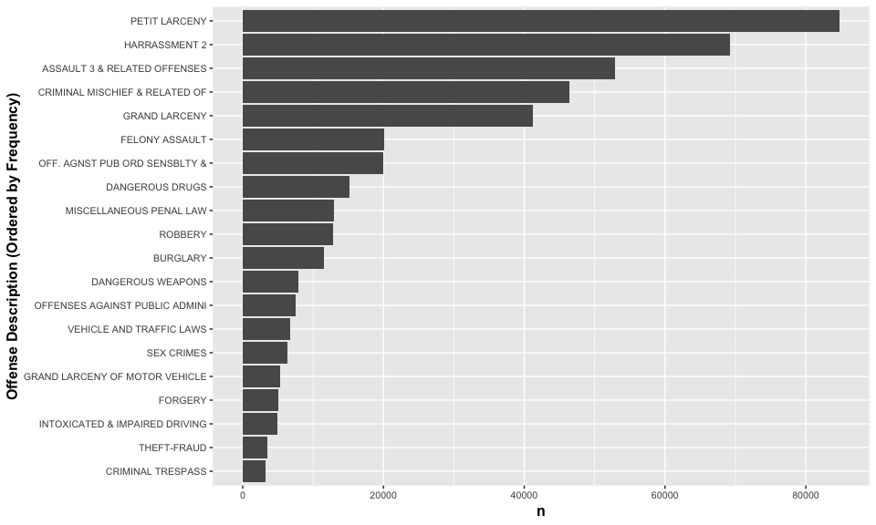
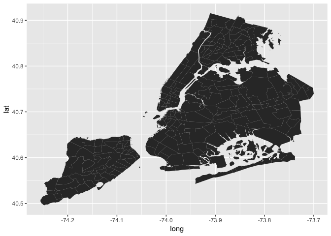
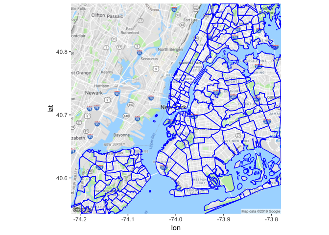
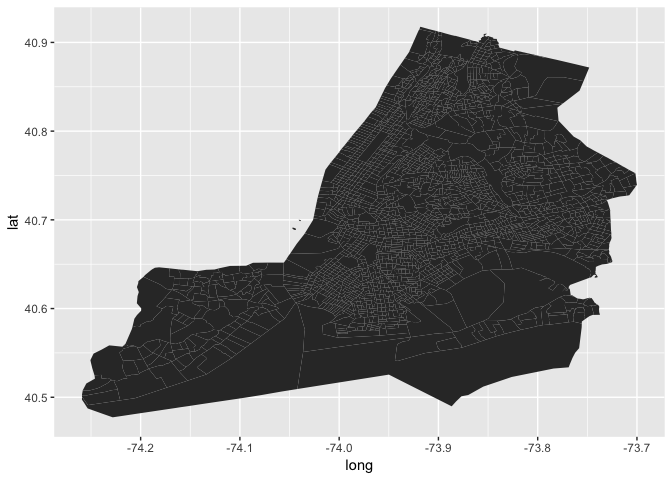

NYC Crime Rate Explore
================
Micaela Chan
4/15/2019

``` r
### == Data Dictionary == ###
# cmplnt_num = unique ID for each complaint
# cmplnt_fr_dt = Exact date of occurrence for the reported event (or starting date of occurrence, if CMPLNT_TO_DT exists)
### ===================== ###

# Check whether there are dates NOT listed as 2018
length(which(!grepl(pattern = "2018", c$cmplnt_fr_dt)))
```

    ## [1] 11068

``` r
# Keep data dated 2018 only 
c <- c[grep(pattern="2018", c$cmplnt_fr_dt),]

# Group dates by Month and Week for plotting
c$cmplnt_ft_month <- cut(c$cmplnt_fr_dt, breaks="month")
c$cmplnt_ft_week <- cut(c$cmplnt_fr_dt, breaks="week")

# Rename month label to text format
monthlabel <- c("Jan","Feb","Mar",
              "Apr","May","Jun",
              "Jul","Aug","Sep",
              "Oct","Nov","Dec")
c$month_incidents <- NA
for(i in 1:length(levels(c$cmplnt_ft_month))){
  c$month_incidents[c$cmplnt_ft_month==levels(c$cmplnt_ft_month)[i]] <- monthlabel[i]
}

ggplot(c, aes(x=month_incidents)) +
  geom_bar(stat = "count") +
  theme_bw() +
  ggtitle("# of Incidents Per Month in 2018 (all category of reports)")
```



``` r
# Number of Offense Description
c$ofns_desc <- factor(c$ofns_desc)
length(levels(c$ofns_desc))
```

    ## [1] 60

``` r
# Simple count plot of Offense Description 
ggplot(data = c, aes(x=ofns_desc)) +
  geom_bar(stat = "count") + 
  xlab("Offense Description") + 
  coord_flip() # Easier to view descriptions
```



``` r
# Remove data with no Offense Description
sum(is.na(c$ofns_desc))
```

    ## [1] 6

``` r
c <- c[!is.na(c$ofns_desc),]

# Plot Top 20 (by count) offense description ordered by frequency of offense
c %>% 
  count(ofns_desc, sort = T) %>% 
  head(n=20) %>% 
  ggplot(aes(x = reorder(ofns_desc, n, sum), y = n)) + 
  xlab("Offense Description (Ordered by Frequency)") + 
  geom_col() +
  coord_flip() +
  theme(axis.text=element_text(size=8),
        axis.title=element_text(size=12,face="bold"))
```



Map them? (To Be Continued...)
------------------------------

#### Neighborhood Level

-   Use Neighborhood intead of Census Tract for size (Neighborhood is larger)
-   Tried simple ggplot map and overlaying on googlemap

``` r
## ** This section of code was borrowed from https://rpubs.com/jhofman/nycmaps

rr <- httr::GET('http://data.beta.nyc//dataset/0ff93d2d-90ba-457c-9f7e-39e47bf2ac5f/resource/35dd04fb-81b3-479b-a074-a27a37888ce7/download/d085e2f8d0b54d4590b1e7d1f35594c1pediacitiesnycneighborhoods.geojson')
nyc_neighborhoods <- rgdal::readOGR(httr::content(rr,'text'), 'OGRGeoJSON', verbose = F)
```

    ## No encoding supplied: defaulting to UTF-8.

``` r
nyc_neighborhoods_df <- broom::tidy(nyc_neighborhoods)
```

    ## Regions defined for each Polygons

``` r
ggplot() + 
  geom_polygon(data=nyc_neighborhoods_df, aes(x=long, y=lat, group=group))
```



``` r
## == overlay neighborhood on city map (googlemap) == ##
library(ggmap)
```

    ## Google's Terms of Service: https://cloud.google.com/maps-platform/terms/.

    ## Please cite ggmap if you use it! See citation("ggmap") for details.

``` r
# register_google(key = "YOUR_API_KEY") # actual API not shown
nyc_map <- get_map(location = c(lon = -74.00, lat = 40.71), maptype = "terrain", zoom = 11)
```

    ## Source : https://maps.googleapis.com/maps/api/staticmap?center=40.71,-74&zoom=11&size=640x640&scale=2&maptype=terrain&language=en-EN&key=xxx-3JpNrFoepsdd2c838GRLvHiGs

``` r
ggmap(nyc_map) + 
  geom_polygon(data=nyc_neighborhoods_df, aes(x=long, y=lat, group=group), color="blue", fill=NA)
```



#### Ceneus Tract is also available

-   Looks stretched (Lat/Long mistmatch?)

``` r
suppressMessages(library(tigris))

lookup_code("New York", "New York")
nyc_tracts <- tracts(state = '36', county = c('061','047','081','005','085')) # hide "loading bar"
nyc_tracts_df <- broom::tidy(nyc_tracts)
```

    ## Regions defined for each Polygons

``` r
ggplot() + 
  geom_polygon(data=nyc_tracts_df, aes(x=long, y=lat, group=group))
```


