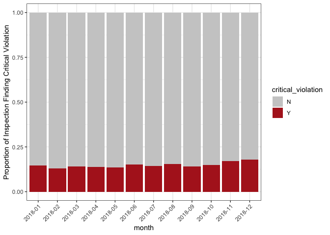
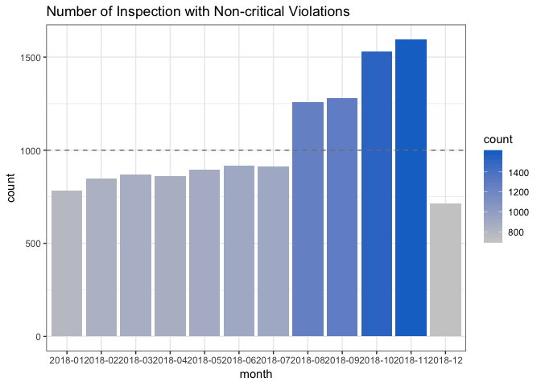
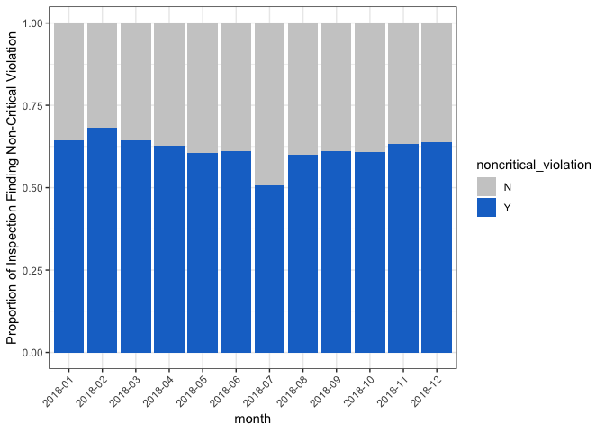
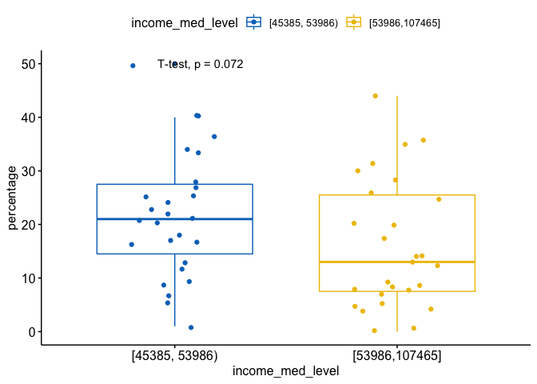
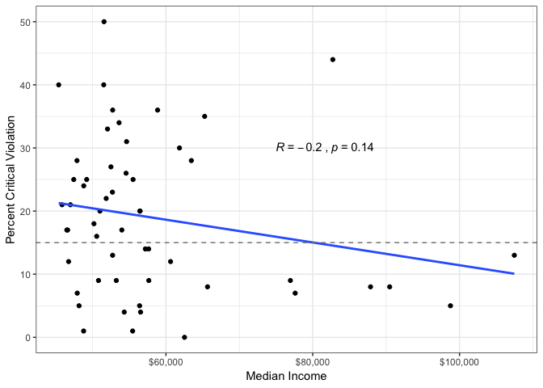

NY Food Inpspection Explore
================
Micaela Chan
4/15/2019

### Load Data

``` r
knitr::opts_chunk$set(echo = TRUE)
suppressMessages(library(tidyverse))
suppressMessages(library(ggpubr))

## == Load Data == ## 
datafile <- "./data/NY_Food-Service-Establishment-Inspections_2005_2019.Rdata"

if(!file.exists(datafile)){   # If data not available, download it.
  suppressMessages(library(RSocrata))
  df <- read.socrata("https://health.data.ny.gov/resource/f285-x9ha.json")
  dir.create("./data")
  save(df, file = datafile)
}else{
  load(datafile)
}
```

New York Food Inspection (2005-2019)
------------------------------------

``` r
# Glance data
# head(df)

# zipcode has lots of white spaces
head(df$zip_code)
```

    ## [1] "12550    " "12550    " "10921    " "12549    " "10924    " "12566    "

``` r
df$zip_code <- trimws(df$zip_code, which = "both")  # removing leading and trailing white space

# Total Unique Violations
# Notes: Cell can contain multipel violations, so a violation of "8A" is diff from "8A, 8B, 10C". 
# Currently not useful, need to find substrings
length(unique(df$violations))
```

    ## [1] 6322

``` r
# Convert string to numeric for count type var
df$total_critical_violations <- as.numeric(df$total_critical_violations) 
df$total_noncritical_violations <- as.numeric(df$total_noncritical_violations)
df$total_crit_not_corrected <- as.numeric(df$total_crit_not_corrected)

# Clean dates
df$date_format <- as.Date(df$date) # Convert date format
df$year <- substr(cut(df$date_format, breaks = "year"), 1,4)    # Make Year variable
df$month <- substr(cut(df$date_format, breaks = "month"), 1,7)  # Make Month variable
```

This data is very 2018-centric
------------------------------

-   May just want to only analyze 2018 data

``` r
ggplot(data = df, aes(x=year)) +
  geom_bar(stat = "count") +
  theme(axis.text.x = element_text(angle = 45, hjust = 1)) +
  ggtitle("Number of inspection per year")
```


Across 2018, the spread of inspection seems heavier on the later months
-----------------------------------------------------------------------

-   Note that these are \# of inspections, not violations.

``` r
df %>%
  filter(year=="2018") %>% 
  group_by(month) %>%
  summarise(n=n()) %>%
  ggdotchart(x="month", y="n", 
             sorting = "descending", 
             add = "segments",
             rotate = TRUE,
             dot.size = 8,
             label = "n", 
             font.label = list(color = "white", size = 8, 
                               vjust = 0.5),
             ggtheme = theme_pubr(), 
             title = "Number of Inspections by Month in 2018 (Most Inspection On Top)")
```


``` r
df %>%
  filter(year=="2018") %>% 
    ggplot(aes(x=month)) +
    geom_bar(stat = "count") +
    facet_wrap(~inspection_type) +
    theme(axis.text.x = element_text(angle = 45, hjust = 1)) +
    ggtitle("Number of Inspection by Month x Inspection Type (2018)")
```


Inspections finding Critical Violation
--------------------------------------

-   Critical Violations seems to occur more during summer months (200+ violations)

``` r
df$critical_violation <- "N"
df$critical_violation[df$total_critical_violations!=0] <- "Y"

df %>%
  filter(year=="2018") %>%
  filter(critical_violation=="Y") %>%
  ggplot(aes(x=month)) +
  geom_bar(stat = "count", aes(fill=..count..)) +
  geom_hline(yintercept = 200, colour="grey50", linetype="dashed") +
  scale_fill_gradient(low = "ghostwhite", high = "firebrick") + 
  ggtitle("Number of Inspection with Critical Violations") +
  theme_bw()
```


### Proportion of critical violation is not increasing

-   The number of inspection during summer months are more frequent.

``` r
## Proportion to # of Inspections Occuring
df %>%
  filter(year=="2018") %>%
  group_by(month,critical_violation) %>%
  summarise(n = n())  %>% 
    ggplot(aes(fill=critical_violation, x=month, y=n)) + 
    geom_bar(stat="identity", position="fill") +
    ylab("Proportion of Inspection Finding Critical Violation") +
    scale_fill_manual(values = c("grey80", "firebrick")) +
    theme_bw() +
    theme(axis.text.x = element_text(angle = 45, hjust = 1)) 
```



Inspections finding Non-critical Violations
-------------------------------------------

``` r
df$noncritical_violation <- "N"
df$noncritical_violation[df$total_noncritical_violations!=0] <- "Y"


df %>%
  filter(year=="2018") %>%
  filter(noncritical_violation=="Y") %>%
  ggplot(aes(x=month)) +
  geom_bar(stat = "count", aes(fill=..count..)) +
  geom_hline(yintercept = 1000, colour="grey50", linetype="dashed") +
  scale_fill_gradient(low = "grey80", high = "dodgerblue3") + 
  ggtitle("Number of Inspection with Non-critical Violations") +
  theme_bw()
```



``` r
## Proportion to # of Inspections Occuring
df %>%
  filter(year=="2018") %>%
  group_by(month,noncritical_violation) %>%
  summarise(n = n())  %>% 
    ggplot(aes(fill=noncritical_violation, x=month, y=n)) + 
    geom_bar(stat="identity", position="fill") +
    ylab("Proportion of Inspection Finding Non-Critical Violation") +
    scale_fill_manual(values = c("grey80", "dodgerblue3")) +
    theme_bw() +
    theme(axis.text.x = element_text(angle = 45, hjust = 1)) 
```



Which County has the most Violation %
-------------------------------------

``` r
countytally <- df %>% 
    filter(year=="2018") %>%
    group_by(county, critical_violation) %>%
    summarise(n=n())

# Add percentage 
countytally$percentage <- NA
for(i in 1:nrow(countytally)){
  countytally$percentage[i] <- round(countytally$n[i]/sum(countytally$n[countytally$county==countytally$county[i]]) * 100)
}
countytally <- countytally[order(countytally$percentage, decreasing = T),]

countytally %>% 
  filter(critical_violation=="Y") %>%
  head(n=20) %>%
    ggdotchart(x="county", y="percentage", 
             sorting = "descending", 
             add = "segments",
             rotate = TRUE,
             dot.size = 8,
             label = "percentage", 
             font.label = list(color = "white", size = 9, 
                               vjust = 0.5),
             ggtheme = theme_pubr(), 
             title = "% of Inspections have Critical Violation in 2018: Top 20 County")
```


``` r
countytally %>% 
  filter(critical_violation=="Y") %>%
  head(n=20) 
```

    ## # A tibble: 20 x 4
    ## # Groups:   county [20]
    ##    county      critical_violation     n percentage
    ##    <chr>       <chr>              <int>      <dbl>
    ##  1 OTSEGO      Y                     76         50
    ##  2 ST LAWRENCE Y                    131         47
    ##  3 SARATOGA    Y                    202         44
    ##  4 DELAWARE    Y                     53         40
    ##  5 HAMILTON    Y                     17         40
    ##  6 ESSEX       Y                    103         36
    ##  7 WARREN      Y                    102         36
    ##  8 ONTARIO     Y                    104         35
    ##  9 WASHINGTON  Y                     32         34
    ## 10 CORTLAND    Y                     52         33
    ## 11 GREENE      Y                     55         31
    ## 12 SCHENECTADY Y                     72         30
    ## 13 CATTARAUGUS Y                     77         28
    ## 14 RENSSELAER  Y                     58         28
    ## 15 SULLIVAN    Y                     84         27
    ## 16 SENECA      Y                     28         26
    ## 17 GENESEE     Y                     56         25
    ## 18 JEFFERSON   Y                     93         25
    ## 19 YATES       Y                     18         25
    ## 20 ORLEANS     Y                     30         24

Do those with bad violation % have lower income?
------------------------------------------------

-   Census data setup requires API registration

``` r
## Follow this guide for more detailed censusapi setup and usage https://cran.r-project.org/web/packages/censusapi/vignettes/getting-started.html
# Add key to .Renviron
# Sys.setenv(CENSUS_KEY=YOURKEYHERE) # Key not shown! 
# Check to see that the expected key is output in your R console
Sys.getenv("CENSUS_KEY")
```

    ## [1] "09a83faec75bd8434b83312827da797e8905d077"

``` r
suppressMessages(library(censusapi))
```

    ## Warning: package 'censusapi' was built under R version 3.5.2

``` r
## Lookup APIS
# apis <- listCensusApis()
# View(apis)
# write.csv(apis, "./cesnus/Census_Apis_20190416.csv", row.names=F)

## Pick apis that should have county-level income/poverty variables
poverty_vars <- listCensusMetadata(name = "timeseries/poverty/saipe", 
    type = "variables")
head(poverty_vars) # SAEMHI_PT=median household income
```

    ##                name
    ## 1             STATE
    ## 2  SAEPOVRT0_4_UB90
    ## 3   SAEPOV5_17R_MOE
    ## 4       SAEMHI_UB90
    ## 5 SAEPOVRT0_17_LB90
    ## 6              YEAR
    ##                                                                label
    ## 1                                                    FIPS State Code
    ## 2  Ages 0-4 in Poverty, Rate Upper Bound for 90% Confidence Interval
    ## 3            Ages 5-17 in Families in Poverty, Count Margin of Error
    ## 4    Median Household Income Upper Bound for 90% Confidence Interval
    ## 5 Ages 0-17 in Poverty, Rate Lower Bound for 90% Confidence Interval
    ## 6                                                      Estimate Year
    ##                  concept group limit predicateType required
    ## 1 Selectable Geographies   N/A     0          <NA>     <NA>
    ## 2    Uncertainty Measure   N/A     0           int     <NA>
    ## 3    Uncertainty Measure   N/A     0           int     <NA>
    ## 4    Uncertainty Measure   N/A     0           int     <NA>
    ## 5    Uncertainty Measure   N/A     0           int     <NA>
    ## 6       Reference Period   N/A     0           int     <NA>

``` r
## Check geography area to grab data
listCensusMetadata(name = "timeseries/poverty/saipe", 
    type = "geography")
```

    ##     name geoLevelId referenceDate requires wildcard optionalWithWCFor
    ## 1     us        010    2012-01-01     NULL     NULL              <NA>
    ## 2  state        040    2012-01-01     NULL     NULL              <NA>
    ## 3 county        050    2012-01-01    state    state             state

``` r
## getCensus data specifying county-level data only in New York state
ny_income <- getCensus(name = "timeseries/poverty/saipe",
    vars = c("NAME", "SAEMHI_PT"), #
    region = "county:*", 
    regionin = "state:36", # only counties within New York
    time = 2017)

ny_income$income <- as.numeric(ny_income$SAEMHI_PT) # Convert median income to numeric variable 
ny_income$county_name <- str_remove(string = ny_income$NAME, pattern = " County") # take out " County" from string
countytally$county_name <- str_to_title(countytally$county) # Change case to "title case" to match Census data

ny_income <- merge(ny_income, countytally[countytally$critical_violation=="Y",],   # merge foodinspec & income data
                   by="county_name")

ny_income$income_med_level <- Hmisc::cut2(ny_income$income, g = 2)
ny_income$income_quartile <- Hmisc::cut2(ny_income$income, g = 4)
```

### Counties with higher income has lower % of critical food inspeciton violation

-   Comparing the counties in the upper vs. lower 50% of median income, there may be a weak assocaition between income and percentage of food violation.

``` r
ny_income %>%
   #filter(income_quartile=="[45385, 50562)" | income_quartile=="[60629,107465]") %>%
    ggboxplot(x = "income_med_level", y = "percentage",
          color = "income_med_level", palette = "jco",
          add = "jitter") +
    stat_compare_means(method = "t.test")
```



The scatter plot shows that while a linear trend is not significant, the counties with the highest income are all under 15% critival violation (grey line), proportion to the \# of inspections conducted.

``` r
suppressMessages(library(scales)) # for labels 

ggplot(ny_income, aes(x=income, y=percentage)) +
  geom_point() +
  geom_smooth(method=lm, se=F) +
  geom_hline(yintercept = 15, colour="grey50", linetype="dashed") +
  xlab("Median Income") +
  ylab("Percent Critical Violation") +
  stat_cor(method = "pearson", label.x = 75000, label.y = 30) +
  scale_x_continuous(labels = dollar) +
  theme_bw()
```


