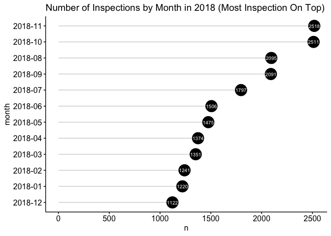
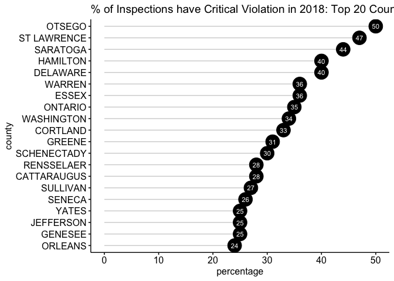

NY Food Inpspection Explore
================
Micaela Chan
4/15/2019

New York Food Inspection (2005-2019)
------------------------------------

``` r
# Glance data
# head(df)

# zipcode has lots of white spaces
head(df$zip_code)
```

    ## [1] "12550    " "12550    " "10921    " "12549    " "10924    " "12566    "

``` r
df$zip_code <- trimws(df$zip_code, which = "both")  # removing leading and trailing white space

# Total Unique Violations
# Notes: Cell can contain multipel violations, so a violation of "8A" is diff from "8A, 8B, 10C". 
# Currently not useful, need to find substrings
length(unique(df$violations))
```

    ## [1] 6322

``` r
# Convert string to numeric for count type var
df$total_critical_violations <- as.numeric(df$total_critical_violations) 
df$total_noncritical_violations <- as.numeric(df$total_noncritical_violations)
df$total_crit_not_corrected <- as.numeric(df$total_crit_not_corrected)

# Clean dates
df$date_format <- as.Date(df$date) # Convert date format
df$year <- substr(cut(df$date_format, breaks = "year"), 1,4)    # Make Year variable
df$month <- substr(cut(df$date_format, breaks = "month"), 1,7)  # Make Month variable
```

This data is very 2018-centric. Might just want to only analyze 2018 data.
--------------------------------------------------------------------------

``` r
ggplot(data = df, aes(x=year)) +
  geom_bar(stat = "count") +
  theme(axis.text.x = element_text(angle = 45, hjust = 1)) +
  ggtitle("Number of inspection per year")
```


Across months, the spread of inspection seems pretty even
---------------------------------------------------------

-   Note that these are \# of inspections, not violations.

``` r
df %>%
  filter(year=="2018") %>% 
    ggplot(aes(x=month)) +
    geom_bar(stat = "count") +
    theme(axis.text.x = element_text(angle = 45, hjust = 1)) +
    ggtitle("Number of Inspection by Month (2018)")
```



``` r
df %>%
  filter(year=="2018") %>% 
    ggplot(aes(x=month)) +
    geom_bar(stat = "count") +
    facet_wrap(~inspection_type) +
    theme(axis.text.x = element_text(angle = 45, hjust = 1)) +
    ggtitle("Number of Inspection by Month x Inspection Type (2018)")
```


``` r
df %>%
  filter(year=="2018") %>% 
    ggplot(aes(x=month)) +
    geom_bar(stat = "count") +
    facet_wrap(~county) +
    theme(axis.text.x = element_text(angle = 45, hjust = 1)) +
    ggtitle("Number of Inspection by County Per month (2018)")
```



Inspections finding Critical Violation
--------------------------------------

``` r
df$critical_violation <- "N"
df$critical_violation[df$total_critical_violations!=0] <- "Y"

df %>%
  filter(year=="2018") %>%
  filter(critical_violation=="Y") %>%
  ggplot(aes(x=month)) +
  geom_bar(stat = "count") +
  ggtitle("Number of Inspection with Critical Violations")
```


Inspections finding Non-critical Violations
-------------------------------------------

``` r
df$noncritical_violation <- "N"
df$noncritical_violation[df$total_noncritical_violations!=0] <- "Y"

df %>%
  filter(year=="2018") %>%
  filter(noncritical_violation=="Y") %>%
  ggplot(aes(x=month)) +
  geom_bar(stat = "count") +
  ggtitle("Number of Inspection with Non-critical Violations")
```


