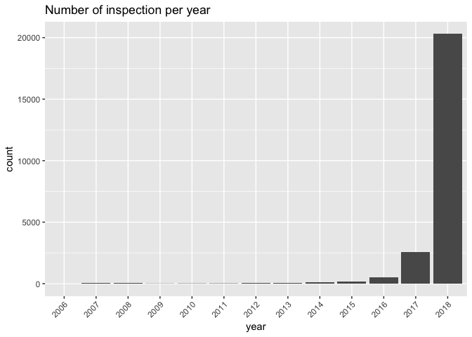

NY Food Inpspection Explore
================
Micaela Chan
4/15/2019

New York Food Inspection (2005-2019)
------------------------------------

``` r
# Glance data
head(df)
```

    ##                          address       city county       date
    ## 1   190  LAKE  STREET,  NEWBURGH   NEWBURGH ORANGE 2018-10-16
    ## 2        287 BROADWAY,  NEWBURGH   NEWBURGH ORANGE 2018-10-16
    ## 3 28 NORTH MAIN STREET,  FLORIDA    FLORIDA ORANGE 2018-10-17
    ## 4 121 HAWKINS DRIVE,  MONTGOMERY MONTGOMERY ORANGE 2018-10-17
    ## 5  159-167  MAIN STREET,  GOSHEN     GOSHEN ORANGE 2018-10-18
    ## 6  78 HOLLAND AVENUE,  PINE BUSH  PINE BUSH ORANGE 2018-10-22
    ##                                               description
    ## 1 Food Service Establishment - Food Service Establishment
    ## 2 Food Service Establishment - Food Service Establishment
    ## 3 Food Service Establishment - Food Service Establishment
    ## 4 Food Service Establishment - Food Service Establishment
    ## 5 Food Service Establishment - Food Service Establishment
    ## 6   Institutional Food Service - School K-12 Food Service
    ##                               facility     facility_address
    ## 1 PATIO RESTAURANT (THE)                  190  LAKE  STREET
    ## 2 RESTAURANTE JALAPENO                       287 BROADWAY  
    ## 3 Sweet Onion Brewhouse                28 NORTH MAIN STREET
    ## 4 CASCARINO'S BRICK OVEN PIZZERIA         121 HAWKINS DRIVE
    ## 5 LIMONCELLO                           159-167  MAIN STREET
    ## 6 E.J. RUSSELL ELEMENTARY                 78 HOLLAND AVENUE
    ##   food_service_facility_state inspection_type local_health_department
    ## 1                          NY   Re-Inspection           Orange County
    ## 2                          NY      Inspection           Orange County
    ## 3                          NY      Inspection           Orange County
    ## 4                          NY   Re-Inspection           Orange County
    ## 5                          NY      Inspection           Orange County
    ## 6                          NY      Inspection           Orange County
    ##   location1.type location1.coordinates municipality
    ## 1          Point   -74.03018, 41.49550     NEWBURGH
    ## 2          Point   -74.02032, 41.50057     NEWBURGH
    ## 3          Point   -74.35708, 41.33266      WARWICK
    ## 4          Point   -74.21233, 41.51249   MONTGOMERY
    ## 5          Point   -74.32056, 41.40322       GOSHEN
    ## 6          Point   -74.30071, 41.60542     CRAWFORD
    ##   nys_health_operation_id nysdoh_gazetteer_1980
    ## 1                  943189                350200
    ## 2                  601352                350200
    ## 3                  914253                353400
    ## 4                  603282                356100
    ## 5                  601490                352300
    ## 6                  602113                355300
    ##                        operation_name perm_operator_first_name
    ## 1                The Patio Restaurant                  Darleny
    ## 2                Restaurante Jalapeno                   Sabino
    ## 3               Sweet Onion Brewhouse                  Kristen
    ## 4     Cascarino's Brick Oven Pizzeria                  Anthony
    ## 5                          Limoncello                    Luigi
    ## 6 E.J. Russell Elementary                                  Lyn
    ##   perm_operator_last_name permit_expiration_date total_crit_not_corrected
    ## 1                Hercules             2019-10-31                        0
    ## 2                 Herrera             2019-10-31                        0
    ## 3                    Said             2019-09-30                        0
    ## 4               Cascarino             2019-05-31                        0
    ## 5                  Kapiti             2019-09-30                        0
    ## 6                 Prestia             2019-09-30                        0
    ##   total_critical_violations total_noncritical_violations
    ## 1                         0                            2
    ## 2                         0                            1
    ## 3                         0                            7
    ## 4                         0                            0
    ## 5                         0                            4
    ## 6                         0                            0
    ##                                                                                                                                                                                                                                                                                                                                                                                                                                                                                                                                                                                                                                                                                                                                                                                                                                                                                                                                                                                                                                   violations
    ## 1                                                                                                                                                                                                                                                                                                                                                                                                                                                                                                                                                                                                                                      Item  8A-   Food not protected during storage, preparation, display, transportation and service, from potential sources of contamination (e.g., food uncovered, mislabeled, stored on floor, missing or inadequate sneeze guards, food containers double stacked); Item 15B-   Lighting and ventilation inadequate, fixtures not shielded, dirty ventilation hoods, ductwork, filters, exhaust fans; 
    ## 2                                                                                                                                                                                                                                                                                                                                                                                                                                                                                                                                                                                                                                                                                                                                                                                                                                                              Item 12E-   Handwashing facilities inaccessible, improperly located, dirty, in disrepair, improper fixtures, soap, and single service towels or hand drying devices missing; 
    ## 3 Item  8A-   Food not protected during storage, preparation, display, transportation and service, from potential sources of contamination (e.g., food uncovered, mislabeled, stored on floor, missing or inadequate sneeze guards, food containers double stacked); Item 10B-   Non-food contact surfaces and equipment are improperly designed, constructed, installed, maintained (equipment not readily accessible for cleaning, surface not smooth finish); Item 11A-   Manual facilities inadequate, technique incorrect; mechanical facilities not operated in accordance with manufacturer's instructions; Item 11D-   Non food contact surfaces of equipment not clean; Item 12E-   Handwashing facilities inaccessible, improperly located, dirty, in disrepair, improper fixtures, soap, and single service towels or hand drying devices missing; Item 15A-   Floors, walls, ceilings, not smooth, properly constructed, in disrepair, dirty surfaces; Item 16-   Miscellaneous, Economic Violation, Choking Poster, Training.; 
    ## 4                                                                                                                                                                                                                                                                                                                                                                                                                                                                                                                                                                                                                                                                                                                                                                                                                                                                                                                                                                                                                       No violations found.
    ## 5                                                                                                                                                                                                                                                                                                                                                                                                                                                                                                                                                                                Item  8C-   Improper use and storage of clean, sanitized equipment and utensils; Item 10B-   Non-food contact surfaces and equipment are improperly designed, constructed, installed, maintained (equipment not readily accessible for cleaning, surface not smooth finish); Item 15A-   Floors, walls, ceilings, not smooth, properly constructed, in disrepair, dirty surfaces; Item 16-   Miscellaneous, Economic Violation, Choking Poster, Training.; 
    ## 6                                                                                                                                                                                                                                                                                                                                                                                                                                                                                                                                                                                                                                                                                                                                                                                                                                                                                                                                                                                                                       No violations found.
    ##    zip_code               permitted_corp_name permitted_d_b_a
    ## 1 12550                                  <NA>            <NA>
    ## 2 12550                                  <NA>            <NA>
    ## 3 10921                          Netsirk, LLC            <NA>
    ## 4 12549              Hudson Valley Pizza, LLC            <NA>
    ## 5 10924                  Il Limon Cella, Inc.            <NA>
    ## 6 12566     Pine Bush Central School District            <NA>
    ##   inspection_comments
    ## 1                <NA>
    ## 2                <NA>
    ## 3                <NA>
    ## 4                <NA>
    ## 5                <NA>
    ## 6                <NA>

``` r
# zipcode has lots of white spaces
head(df$zip_code)
```

    ## [1] "12550    " "12550    " "10921    " "12549    " "10924    " "12566    "

``` r
df$zip_code <- trimws(df$zip_code, which = "both")  # removing leading and trailing white space

# Total Unique Violations
# Notes: Cell can contain multipel violations, so a violation of "8A" is diff from "8A, 8B, 10C". 
# Currently not useful, need to find substrings
length(unique(df$violations))
```

    ## [1] 6322

``` r
# Convert string to numeric for count type var
df$total_critical_violations <- as.numeric(df$total_critical_violations) 
df$total_noncritical_violations <- as.numeric(df$total_noncritical_violations)
df$total_crit_not_corrected <- as.numeric(df$total_crit_not_corrected)

# Clean dates
df$date_format <- as.Date(df$date) # Convert date format
df$year <- substr(cut(df$date_format, breaks = "year"), 1,4)    # Make Year variable
df$month <- substr(cut(df$date_format, breaks = "month"), 1,7)  # Make Month variable
```

This data is very 2018-centric. Might just want to only analyze 2018 data.
--------------------------------------------------------------------------

``` r
ggplot(data = df, aes(x=year)) +
  geom_bar(stat = "count") +
  theme(axis.text.x = element_text(angle = 45, hjust = 1)) +
  ggtitle("Number of inspection per year")
```



Across months, the spread of inspection seems pretty even
---------------------------------------------------------

``` r
df %>%
  filter(year=="2018") %>% 
    ggplot(aes(x=month)) +
    geom_bar(stat = "count") +
    theme(axis.text.x = element_text(angle = 45, hjust = 1)) +
    ggtitle("Number of Inspection by Month (2018)")
```


``` r
df %>%
  filter(year=="2018") %>% 
    ggplot(aes(x=month)) +
    geom_bar(stat = "count") +
    facet_wrap(~inspection_type) +
    theme(axis.text.x = element_text(angle = 45, hjust = 1)) +
    ggtitle("Number of Inspection by Month x Inspection Type (2018)")
```


``` r
df %>%
  filter(year=="2018") %>% 
    ggplot(aes(x=month)) +
    geom_bar(stat = "count") +
    facet_wrap(~county) +
    theme(axis.text.x = element_text(angle = 45, hjust = 1)) +
    ggtitle("Number of Inspection by County Per month (2018)")
```


